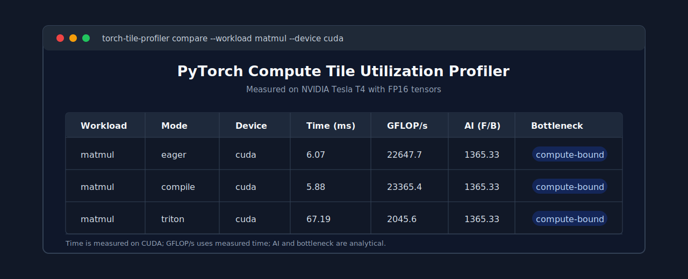

# PyTorch Compute Tile Utilization Profiler

An open-source PyTorch profiling tool that estimates FLOPs, memory traffic,
arithmetic intensity, and compute-vs-memory bottlenecks for tensor workloads.
It wraps `torch.profiler`, runs repeatable workloads, and exports runtime tables
as JSON or CSV.



## Features

- Profiles matrix multiplication, convolution, and transformer-style attention.
- Uses `torch.profiler` for CPU/CUDA timing and operator traces.
- Estimates FLOPs, memory traffic, arithmetic intensity, and bottleneck class.
- Compares PyTorch eager mode and `torch.compile` when available.
- Sweeps matrix tile sizes to show how shape choices affect utilization.
- Exports machine-readable JSON and CSV reports.
- Includes a roofline-style summary using configurable peak FLOP/s and bandwidth.

## Quick Start

```bash
python -m venv .venv
source .venv/bin/activate
python3 -m pip install -e ".[torch,dev]"

torch-tile-profiler profile --workload matmul --device cuda --mode eager --json reports/matmul.json --csv reports/matmul.csv
```

CPU-only machines work too:

```bash
torch-tile-profiler profile --workload conv2d --device cpu --mode eager
```

Compare eager, compiled PyTorch, and the optional Triton tile kernel:

```bash
python3 -m pip install -e ".[torch,triton]"
torch-tile-profiler compare --workload matmul --device cuda --modes eager compile triton
```

Run a tile sweep:

```bash
torch-tile-profiler sweep --device cuda --m 4096 --n 4096 --k 4096 --tile-sizes 16 32 64 128
```

## Example Output

```text
                         PyTorch Compute Tile Utilization Profiler
┏━━━━━━━━━━━┳━━━━━━━━━┳━━━━━━━━┳━━━━━━━━━━━┳━━━━━━━━━━┳━━━━━━━━━━━━━━┳━━━━━━━━━━━━━━━━┓
┃ Workload  ┃ Mode    ┃ Device ┃ Time (ms) ┃ GFLOP/s  ┃ AI (F/B)     ┃ Bottleneck     ┃
┡━━━━━━━━━━━╇━━━━━━━━━╇━━━━━━━━╇━━━━━━━━━━━╇━━━━━━━━━━╇━━━━━━━━━━━━━━╇━━━━━━━━━━━━━━━━┩
│ matmul    │ eager   │ cuda   │ 4.82      │ 7131.6   │ 341.33       │ compute-bound  │
│ matmul    │ compile │ cuda   │ 4.51      │ 7622.2   │ 341.33       │ compute-bound  │
└───────────┴─────────┴────────┴───────────┴──────────┴──────────────┴────────────────┘
```

## How Bottlenecks Are Classified

For each workload, the profiler computes:

```text
arithmetic_intensity = estimated_flops / estimated_memory_bytes
roofline_threshold = peak_flops_per_second / peak_bandwidth_bytes_per_second
```

If arithmetic intensity is below the threshold, the workload is classified as
memory-bound. Otherwise, it is compute-bound. Defaults are conservative and can
be overridden:

```bash
torch-tile-profiler profile --peak-tflops 82.6 --bandwidth-gbps 1008
```

## Project Layout

```text
src/torch_tile_profiler/
  cli.py          # command-line interface
  estimator.py    # FLOP/memory/arithmetic intensity formulas
  profiler.py     # torch.profiler orchestration
  workloads.py    # matmul, conv2d, attention workload definitions
  reports.py      # JSON/CSV export and terminal tables
tests/
  test_estimator.py
```
