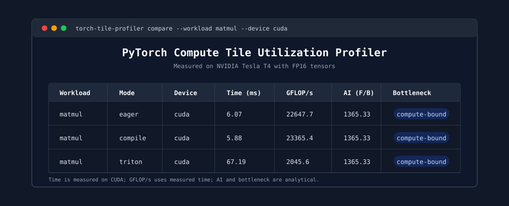

# PyTorch GPU Profiling and Autotuning

This project measures PyTorch workloads, models their roofline position, sweeps optimization candidates, and exports reproducible performance reports. It covers matrix multiplication, convolution, and transformer-style attention across eager PyTorch, `torch.compile`, targeted PyTorch implementations, and optional Triton kernels.



## What is implemented

- Synchronized CPU or CUDA benchmarking with `torch.profiler` traces collected outside the timed region.
- FLOP, memory-traffic, arithmetic-intensity, and compute-vs-memory roofline estimates.
- `torch.compile` configuration sweeps over `default`, `reduce-overhead`, and `max-autotune`.
- Measured Triton matmul sweeps over block M/N/K, warp count, and pipeline stages, with correctness checks against `torch.matmul`.
- Roofline-guided candidates: fused scaled-dot-product attention for memory-bound attention and channels-last convolution plus compiler/kernel tuning for compute-bound workloads.
- JSON, CSV, and Markdown reports that recompute latency and throughput improvements from raw timings.
- A Codex plugin containing two custom skills and a local MCP server with profiling, autotuning, tile-sweep, and full-diagnosis tools.

## Install

```bash
python -m venv .venv
source .venv/bin/activate
python -m pip install -e ".[torch,dev]"
```

Install Triton on a supported CUDA system to include the custom kernel sweep:

```bash
python -m pip install -e ".[torch,triton,dev]"
```

## One-command diagnosis

Run the full workflow on a CUDA system with a 4096 x 4096 x 4096 FP16 matmul shape:

```bash
torch-tile-profiler diagnose \
  --device cuda \
  --dtype float16 \
  --m 4096 --n 4096 --k 4096 \
  --peak-tflops 65 --bandwidth-gbps 320 \
  --warmup 20 --iterations 100 \
  --output-dir reports/t4
```

This command benchmarks eager and compiled candidates for all workloads, adds SDPA and channels-last candidates where appropriate, measures Triton tile configurations for matmul, and writes:

```text
reports/t4/
  matmul.json       # candidate results and failures
  matmul.csv        # flat candidate timing table
  conv2d.json
  conv2d.csv
  attention.json
  attention.csv
  diagnosis.json    # aggregate metrics
  diagnosis.md      # readable summary
```

## Individual operations

Profile one workload:

```bash
torch-tile-profiler profile --workload attention --device cuda --dtype float16
```

Autotune one workload:

```bash
torch-tile-profiler autotune \
  --workload matmul --device cuda --dtype float16 \
  --m 4096 --n 4096 --k 4096 \
  --tile-sizes 32 64 128 \
  --json reports/matmul-autotune.json \
  --csv reports/matmul-autotune.csv
```

Benchmark a repeatable suite of smaller matmuls where kernel selection may have more optimization headroom:

```bash
torch-tile-profiler small-matmul \
  --device cuda --dtype float16 \
  --shapes 512x512x512 1024x1024x1024 2048x2048x2048 512x2048x512 \
  --tile-sizes 32 64 128 \
  --warmup 20 --iterations 100 \
  --output-dir reports/small-matmul
```

The command writes raw JSON/CSV results for every shape plus `small-matmul-summary.json` and `small-matmul-summary.md`. The summary reports the highest measured throughput gain; it does not assume that any configuration reaches a particular percentage.

Run an analytical tile-utilization sweep without a GPU, or add `--measure` on CUDA to benchmark the Triton configurations:

```bash
torch-tile-profiler sweep --device cuda --m 4096 --n 4096 --k 4096 --tile-sizes 32 64 128 --measure
```

## How roofline analysis guides the search

For each candidate:

```text
arithmetic_intensity = estimated_flops / estimated_memory_bytes
ridge_point = peak_flops_per_second / peak_bandwidth_bytes_per_second
```

Arithmetic intensity below the ridge point is predicted memory-bound; otherwise it is predicted compute-bound. Manual attention accounts for the repeated HBM traffic caused by materializing and rereading the score/probability matrix. Fused SDPA uses a separate traffic model because it avoids that materialization. These are analytical traffic models, not GPU hardware counters.

The tuner responds to the baseline class:

| Baseline class | Workload | Candidates added |
| --- | --- | --- |
| Memory-bound | attention | fused SDPA and compiled SDPA |
| Compute-bound | matmul | compile modes and Triton block/warp/stage configurations |
| Compute-bound | convolution | channels-last layout and compiled channels-last |

## Codex plugin

The repository plugin is at [`plugins/torch-tile-profiler`](plugins/torch-tile-profiler). It bundles:

- `diagnose-pytorch-gpu`: a workflow for evidence-backed roofline diagnosis.
- `autotune-pytorch-kernels`: a workflow for measured candidate selection.
- `.mcp.json`: a stdio MCP server configuration exposing `profile_workload`, `autotune_workload`, `tile_size_sweep`, and `diagnose_pytorch`.

Install the Python project first so the `torch-tile-profiler-mcp` entry point is on `PATH`, then install or load the repository plugin in Codex.

## Project layout

```text
src/torch_tile_profiler/
  autotune.py        # candidate generation, ranking, aggregate metrics
  cli.py             # profile, compare, sweep, autotune, diagnose commands
  estimator.py       # FLOP, traffic, arithmetic-intensity formulas
  mcp_server.py      # dependency-light stdio MCP server
  profiler.py        # synchronized measurement and torch.profiler trace
  reports.py         # JSON/CSV/table export
  triton_kernels.py  # configurable, correctness-checked Triton matmul
  workloads.py       # matmul, convolution, and attention implementations
plugins/torch-tile-profiler/
  .codex-plugin/plugin.json
  .mcp.json
  skills/
tests/
```

Run the test and package validators:

```bash
pytest -q
python /path/to/skill-creator/scripts/quick_validate.py plugins/torch-tile-profiler/skills/diagnose-pytorch-gpu
python /path/to/skill-creator/scripts/quick_validate.py plugins/torch-tile-profiler/skills/autotune-pytorch-kernels
python /path/to/plugin-creator/scripts/validate_plugin.py plugins/torch-tile-profiler
```
